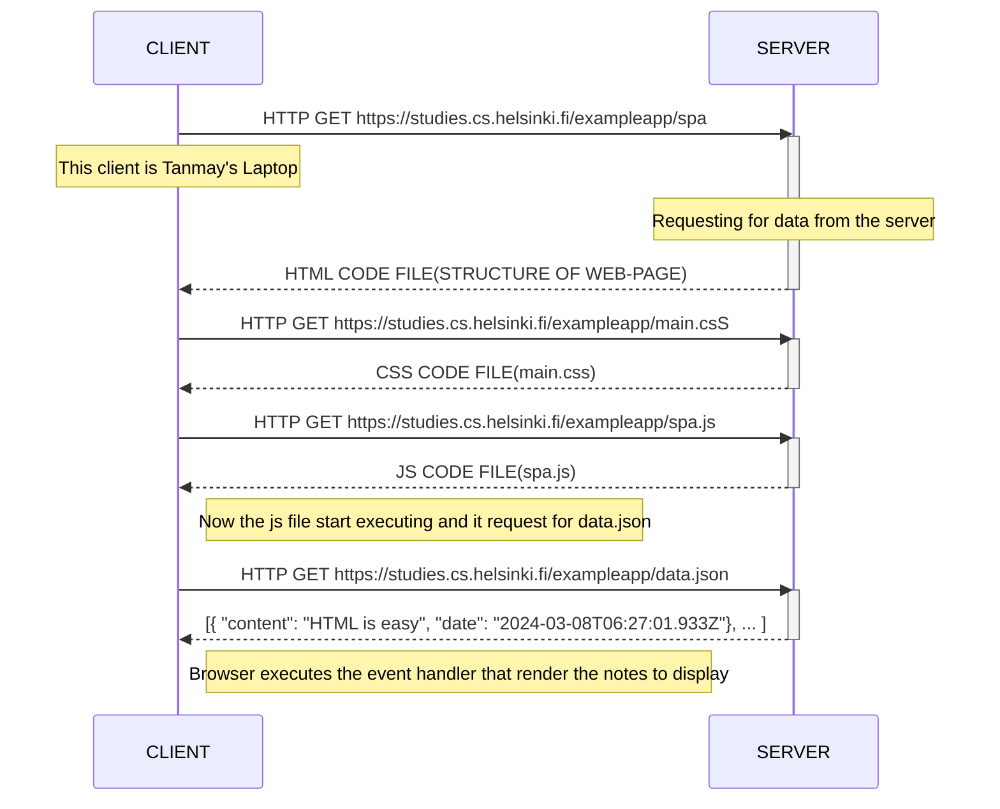

```mermaid
sequenceDiagram
CLIENT->>SERVER : HTTP GET https://studies.cs.helsinki.fi/exampleapp/spa
activate SERVER
Note over CLIENT : This client is Tanmay's Laptop
Note over SERVER : Requesting for data from the server
SERVER-->>CLIENT : HTML CODE FILE(STRUCTURE OF WEB-PAGE)
deactivate SERVER

CLIENT->>SERVER : HTTP GET https://studies.cs.helsinki.fi/exampleapp/main.csS
activate SERVER
SERVER -->> CLIENT : CSS CODE FILE(main.css)
deactivate SERVER

CLIENT ->> SERVER : HTTP GET https://studies.cs.helsinki.fi/exampleapp/spa.js
activate SERVER
SERVER -->> CLIENT : JS CODE FILE(spa.js)
deactivate SERVER


Note right of CLIENT : Now the js file start executing and it request for data.json
CLIENT ->> SERVER : HTTP GET https://studies.cs.helsinki.fi/exampleapp/data.json
activate SERVER
SERVER -->> CLIENT : [{ "content": "HTML is easy", "date": "2024-03-08T06:27:01.933Z"}, ... ]
deactivate SERVER
Note right of CLIENT : Browser executes the event handler that render the notes to display
```
