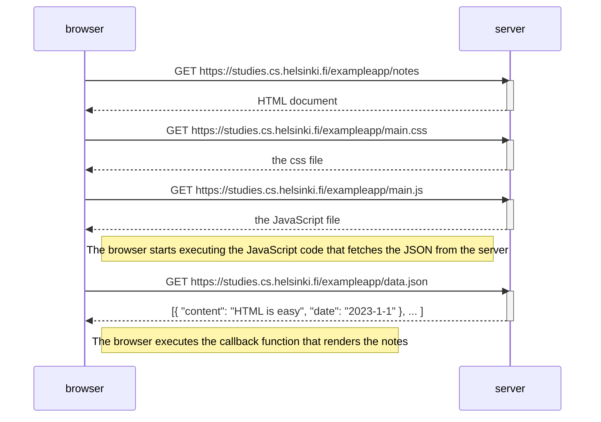
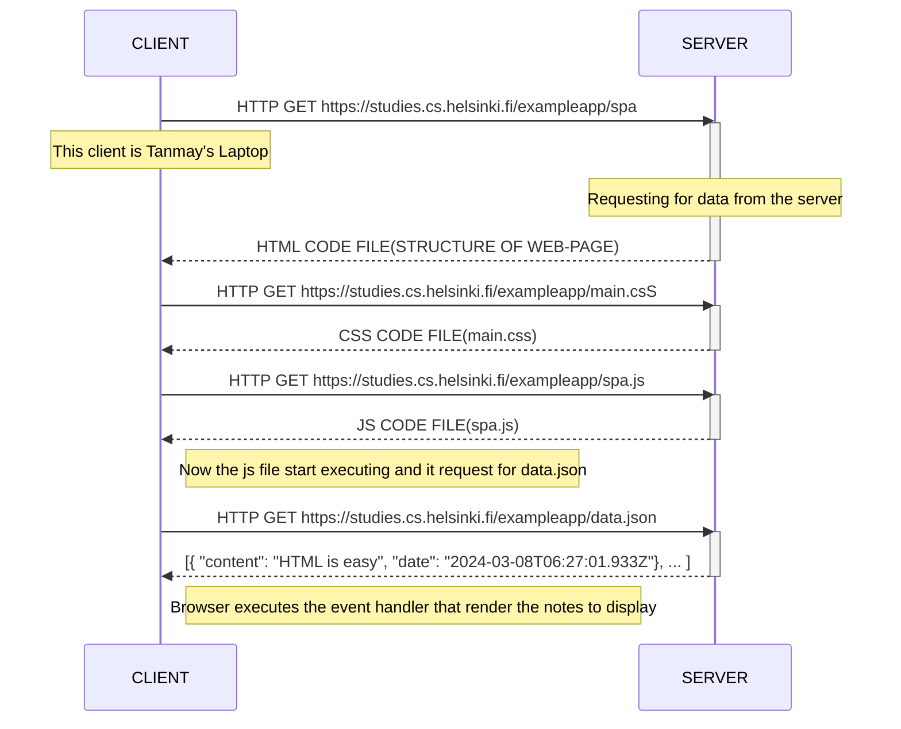
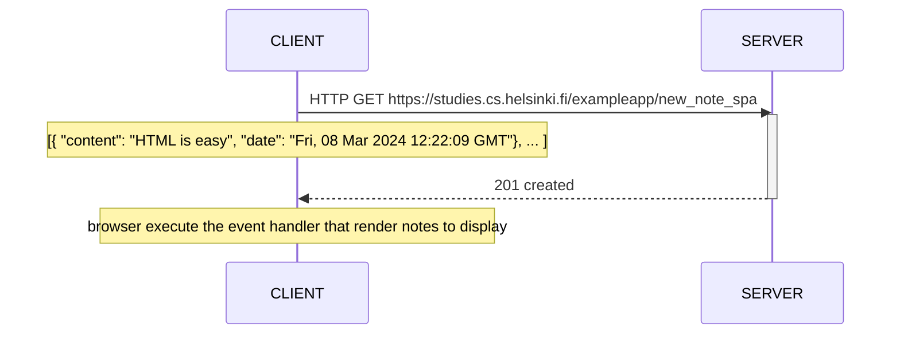

# PART0
## Exercise 0.4 , 0.5 , 0.6

# Exercise 0.4

```mermaid
sequenceDiagram
    participant browser
    participant server

    browser->>server: GET https://studies.cs.helsinki.fi/exampleapp/notes
    activate server
    server-->>browser: HTML document
    deactivate server

    browser->>server: GET https://studies.cs.helsinki.fi/exampleapp/main.css
    activate server
    server-->>browser: the css file
    deactivate server

    browser->>server: GET https://studies.cs.helsinki.fi/exampleapp/main.js
    activate server
    server-->>browser: the JavaScript file
    deactivate server

    Note right of browser: The browser starts executing the JavaScript code that fetches the JSON from the server

    browser->>server: GET https://studies.cs.helsinki.fi/exampleapp/data.json
    activate server
    server-->>browser: [{ "content": "HTML is easy", "date": "2023-1-1" }, ... ]
    deactivate server

    Note right of browser: The browser executes the callback function that renders the notes
```

# Exercise 0.5

```mermaid
sequenceDiagram
CLIENT->>SERVER : HTTP GET https://studies.cs.helsinki.fi/exampleapp/spa
activate SERVER
Note over CLIENT : This client is Tanmay's Laptop
Note over SERVER : Requesting for data from the server
SERVER-->>CLIENT : HTML CODE FILE(STRUCTURE OF WEB-PAGE)
deactivate SERVER

CLIENT->>SERVER : HTTP GET https://studies.cs.helsinki.fi/exampleapp/main.csS
activate SERVER
SERVER -->> CLIENT : CSS CODE FILE(main.css)
deactivate SERVER

CLIENT ->> SERVER : HTTP GET https://studies.cs.helsinki.fi/exampleapp/spa.js
activate SERVER
SERVER -->> CLIENT : JS CODE FILE(spa.js)
deactivate SERVER


Note right of CLIENT : Now the js file start executing and it request for data.json
CLIENT ->> SERVER : HTTP GET https://studies.cs.helsinki.fi/exampleapp/data.json
activate SERVER
SERVER -->> CLIENT : [{ "content": "HTML is easy", "date": "2024-03-08T06:27:01.933Z"}, ... ]
deactivate SERVER
Note right of CLIENT : Browser executes the event handler that render the notes to display
```

# Exercise 0.6

```mermaid
sequenceDiagram
    participant CLIENT
    participant SERVER
CLIENT->>SERVER : HTTP GET https://studies.cs.helsinki.fi/exampleapp/new_note_spa
activate SERVER
Note over CLIENT : [{ "content": "HTML is easy", "date": "Fri, 08 Mar 2024 12:22:09 GMT"}, ... ]
SERVER-->>CLIENT : 201 created
deactivate SERVER

Note over CLIENT : browser execute the event handler that render notes to display
```
